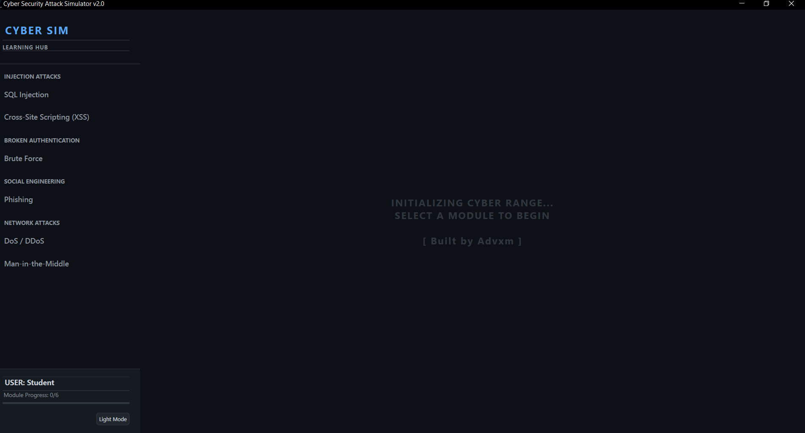
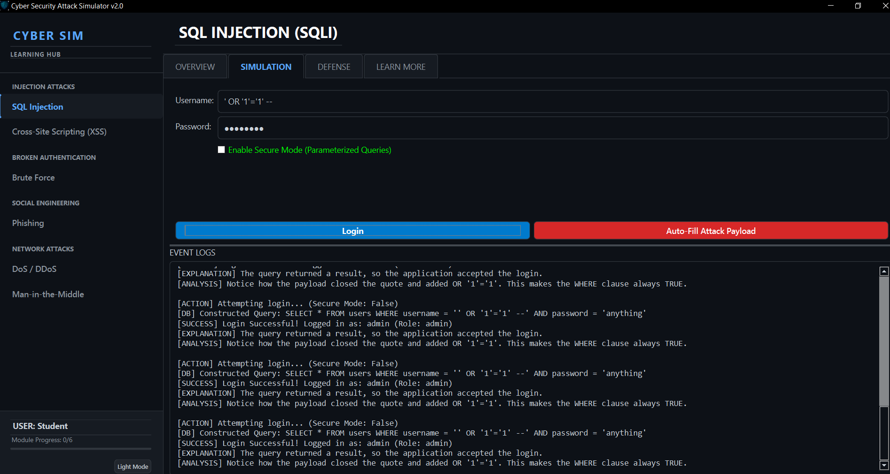
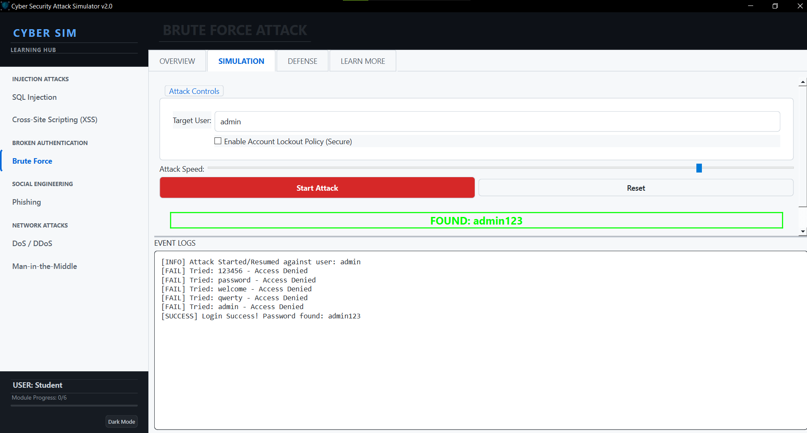

# Cyber Security Attack Simulator v2.0


**Cyber Sim 2.0** is a professional-grade educational platform designed to teach cybersecurity concepts through interactive simulations. Built with Python and PySide6, it features a modern "Hacker" aesthetic, a centralized Learning Hub, and detailed breakdown tabs for every attack module.

> **Built by Advxm**

---

## 🚀 Features

-   **Learning Hub Sidebar**: Centralized navigation with progress tracking.
-   **4-Tab Architecture**: Every attack module includes:
    -   **Overview**: Theory, Anatomy, and Impact analysis.
    -   **Simulation**: Interactive lab to perform the attack.
    -   **Defense**: Blue Team strategies and code fixes.
    -   **Learn More**: Real-world case studies (e.g., Sony, Mirai) and resources.
-   **Professional UI**:
    -   **Dark Mode**: High-contrast, neon-accented cyber theme.
    -   **Light Mode**: Clean, corporate "Day Mode" toggle.
    -   **Splitter Controls**: Resizable simulation/log consoles.
-   **6 Interactive Modules**:
    -   SQL Injection
    -   Cross-Site Scripting (XSS)
    -   Brute Force
    -   Phishing
    -   Denial of Service (DoS)
    -   Man-in-the-Middle (MITM)

---

## 🛠️ Installation

1.  **Clone the repository**:
    ```bash
    git clone https://github.com/yourusername/cyber-sim.git
    cd cyber-sim
    ```

2.  **Install Dependencies**:
    ```bash
    pip install -r requirements.txt
    ```

3.  **Run the Application**:
    ```bash
    python src/main.py
    ```

---

## 📸 Screenshots

### Learning Hub & Home
*(Add screenshot of the main dashboard here)*

### Attack Simulation (SQL Injection)
*(Add screenshot of the SQLi Overview & Simulation tabs)*

### Dark vs. Light Mode
*(Add comparison screenshots here)*

---

## 📚 Modules Overview

| Module | Description | Key Concept |
| :--- | :--- | :--- |
| **SQL Injection** | Bypass login screens using malicious SQL. | `SELECT * FROM users WHERE user = '' OR '1'='1'` |
| **XSS** | Inject scripts into web pages. | `<script>alert(1)</script>` |
| **Brute Force** | Crack passwords using dictionary attacks. | Account Lockout Policies |
| **Phishing** | Analyze fraudulent emails. | Link Inspection |
| **DoS** | Simulate botnet attacks on a server. | Rate Limiting |
| **MITM** | Intercept and modify traffic. | Encryption (HTTPS) |

---

## 📝 License

This project is for **educational purposes only**. Use responsibly and only on systems you own or have permission to test.
